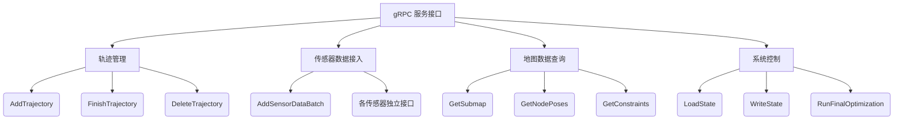
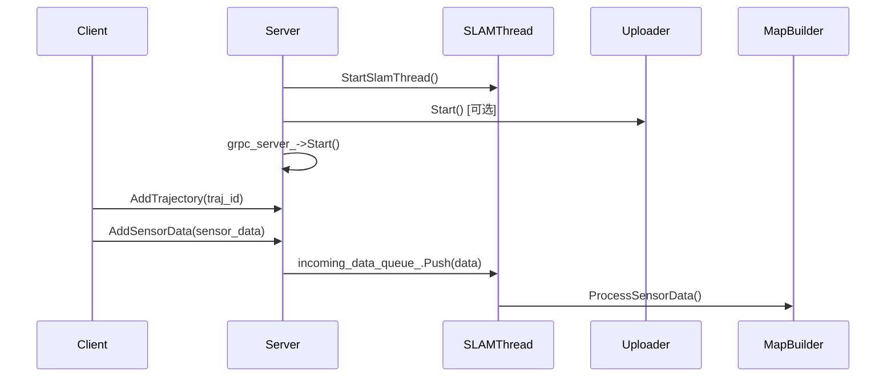

# cloud

* Cartographer 云服务系统,云端服务器建图，本地建图不需要此功能

* #TODO: (low) 后续分析

Cartographer 云服务系统中 `MapBuilderServer` 类的完整实现，它是 Cartographer 分布式 SLAM 架构的核心服务器组件。下面从设计理念、核心功能和关键流程三方面深入解析：

### 一、设计理念

1. **云-边分离架构**：
   * 实现 SLAM 服务的远程调用（gRPC）
   * 支持多客户端协作建图（典型如多机器人系统）
   * 通过 `LocalTrajectoryUploader` 支持分层架构（边端设备→云服务器）

2. **线程模型**：
   * **gRPC 线程**：处理远程调用（`num_grpc_threads` 配置）
   * **事件线程**：处理 I/O 事件（`num_event_threads` 配置）
   * **SLAM 处理线程**：专用线程消费传感器数据队列（核心建图线程）

3. **订阅发布模式**：
   * `local_slam_subscriptions`/`global_slam_subscriptions` 管理结果订阅
   * 解耦 SLAM 处理与结果分发

### 二、核心功能模块



#### 1. 网络通信层

* **配置要点**：

  ```cpp
  server_builder.SetMaxSendMessageSize(kMaxMessageSize);   // 100MB
  server_builder.SetMaxReceiveMessageSize(kMaxMessageSize);
  ```

* **协议优化**：支持大尺寸消息（如点云数据）

* **安全机制**：可选 SSL 加密和谷歌身份验证
* **上下文切换**：根据 2D/3D 模式动态创建 `MapBuilderContext`

#### 2. 数据流水线

```cpp
void MapBuilderServer::ProcessSensorDataQueue() {
  while (!shutting_down_) {
    auto sensor_data = incoming_data_queue_.PopWithTimeout(kPopTimeout);
    if (sensor_data) {
      // 核心数据消费入口
      grpc_server_->GetContext()->AddSensorDataToTrajectory(*sensor_data);
    }
  }
}
```

* **双缓冲队列**：`incoming_data_queue_` 隔离网络接收与 SLAM 处理

* **流量控制**：`kPopTimeout` 防止空转消耗 CPU
* **监控支持**：`kIncomingDataQueueMetric` 暴露队列长度指标

#### 3. 结果分发机制

* **本地 SLAM 结果分发**：

  ```cpp
  void OnLocalSlamResult(...) {
    // 数据上传云端
    if (local_trajectory_uploader_) {
      CreateSensorDataForLocalSlamResult(...);
      EnqueueSensorData(std::move(sensor_data));
    }
    
    // 通知订阅者
    for (auto& entry : local_slam_subscriptions_[trajectory_id]) {
      callback(absl::make_unique<LocalSlamResult>(...));
    }
  }
  ```

* **全局优化结果分发**：

  ```cpp
  void OnGlobalSlamOptimizations(...) {
    for (auto& entry : global_slam_subscriptions_) {
      callback(last_optimized_submap_ids, last_optimized_node_ids);
    }
  }
  ```

### 三、关键业务流程

#### 1. 系统启动流程



#### 2. 关闭流程

```cpp
void Shutdown() {
  shutting_down_ = true;           // 通知SLAM线程停止
  grpc_server_->Shutdown();         // 停止gRPC服务
  if (slam_thread_) slam_thread_->join();
  if (uploader_) uploader_->Shutdown();
}
```

#### 3. 异常处理机制

* **线程安全防护**：`absl::MutexLock` 保护订阅列表

* **资源泄漏防护**：`slam_thread_->join()` 保证线程退出
* **状态一致性**：

  ```cpp
  void NotifyFinishTrajectory(int trajectory_id) {
    // 通过nullptr通知订阅者轨迹结束
    callback(nullptr); 
  }
  ```

### 四、设计亮点

1. **动态上下文切换**：

   ```cpp
   if (use_2d) {
     grpc_server_->SetExecutionContext(
         absl::make_unique<MapBuilderContext<Submap2D>>(this));
   } else if (use_3d) {
     grpc_server_->SetExecutionContext(
         absl::make_unique<MapBuilderContext<Submap3D>>(this));
   }
   ```

   支持运行时切换 2D/3D 模式

2. **增量式数据上传**：

   ```cpp
   if (insertion_result && local_trajectory_uploader_) {
     CreateSensorDataForLocalSlamResult(...);
     EnqueueSensorData(...);
     if (submap_insertion_finished) ++starting_submap_index_;
   }
   ```

   仅在有新子图时上传，优化带宽

3. **零拷贝数据传输**：

   ```cpp
   auto shared_range_data = std::make_shared<sensor::RangeData>(
       std::move(range_data));
   ```

   通过共享指针避免结果数据复制

### 五、性能关键点

1. **队列阻塞控制**：
   * 超时机制：`PopWithTimeout(kPopTimeout)` 避免忙等待
   * 负载监控：`kIncomingDataQueueMetric` 提供系统健康状态

2. **资源清理保障**：

   ```cpp
   UnsubscribeLocalSlamResults(...) {
     CHECK_EQ(..., 1u); // 严格校验资源释放
   }
   ```

   防止订阅者泄漏导致内存增长

该实现体现了云原生 SLAM 系统的核心设计原则：

1. **服务化**：通过 gRPC 暴露标准 SLAM 接口
2. **弹性化**：线程池 + 异步队列应对负载波动
3. **可观测**：内置监控指标输出
4. **可扩展**：订阅机制支持功能扩展

特别值得注意的是其对分布式部署的支持：

* **边设备**：只需轻量级传感器数据发送
* **云服务器**：集中优化处理与地图融合
* **结果分发**：同时服务实时应用（如导航）和离线应用（如建图）

这样的设计使 Cartographer 能适应从单机器人到机器人集群的各种应用场景。
