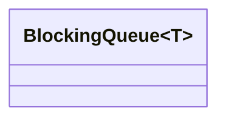

# common


 	
## BlockingQueue


* 标准的阻塞队列实现

> 优点：
* 多线程数据安全；
* 支持有限大小和无限大小的队列：
  * 通过queue_size_控制，当queue_size_为kInfiniteQueueSize（0）时表示无限大小，否则为有限大小；
* 支持超时操作：
  * 除了普通的Push和Pop，还提供了PushWithTimeout和PopWithTimeout，可以避免阻塞；

----

## FileResolver


* 参数文件（.lua）加载读取 , LuaParameterDictionary 提供 参数读取接口；


## FixedRatioSampler

* 固定比率采样器
  * 每调用一次 Pulse() 一个数据点（脉冲），动态决定是否采样(按ratio_比例)；
  * 采样Pulse()返回True;

---

## Histogram 

* 直方图类Histogram，用于将直方图数据转换为可读的字符串格式。
  * 计算基础统计值（数量、最小值、最大值、平均值），并将数据按指定桶数（buckets）分组后可视化。
```bash
Count: 100 Min: 1.0 Max: 10.0 Mean: 5.5
[1.0, 3.0)      ####                Count: 20 (20%)   Total: 20 (20%)
[3.0, 5.0)      ########             Count: 30 (30%)   Total: 50 (50%)
[5.0, 7.0]      #############        Count: 50 (50%)   Total: 100 (100%)
```

---

## RateTimer
* 用于计算事件频率

* Pulse(common::Time time) 添加事件时间
* ComputeRate() 计算事件频率（如lidar数据的发送频率）
  * Returns the pulse rate in Hz.
* WallTime 采用 std::chrono::steady_clock；
---

## time.h
* 时间转换相关函数；
---

## ThreadPool
* 线程池；


> 优点：
* 线程安全；
* task按依赖顺序执行： 
  * task 事件可设置 Dependencies 依赖，相关依赖task执行完后会调用dependent_task->OnDependenyCompleted()，所以依赖执行完才会把该task送入线程池task_queue_；
* 多个task按依赖构成 有向无环图（DAG）；
> 缺点：
* 未对循环依赖（dependency cycles）检测​​。
  * 如果三个任务相互形成依赖环（如 TaskA → TaskB → TaskC → TaskA），将导致死锁​​；
---