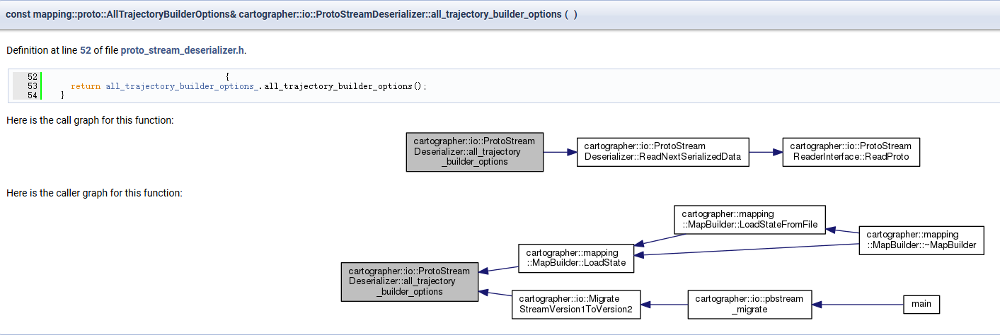
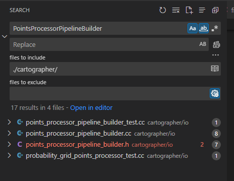

# io

* 从文件中反序列化（读取）Proto协议数据的工具
  * all_trajectory_builder_options : 存储所有轨迹的配置参数
  * pose_graph : 位姿图
* 使用cairo画图（未见使用）

[toc]

## ProtoStreamDeserializer

> 反序列化（读取）Proto协议数据的工具

* all_trajectory_builder_options : 存储所有轨迹的配置参数
* pose_graph : 位姿图

## PointsProcessor

> 使用cairo画图,cartographer内部未见使用该功能；

## cairo

* Cairo（libcairo）​​ 是一个开源的 ​​2D 矢量图形库​​，用于图形输出(PNG,SVG,PCD,...)
* link : <https://www.cairographics.org/>
