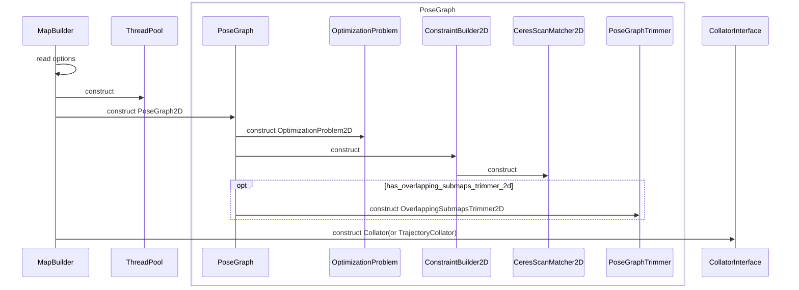
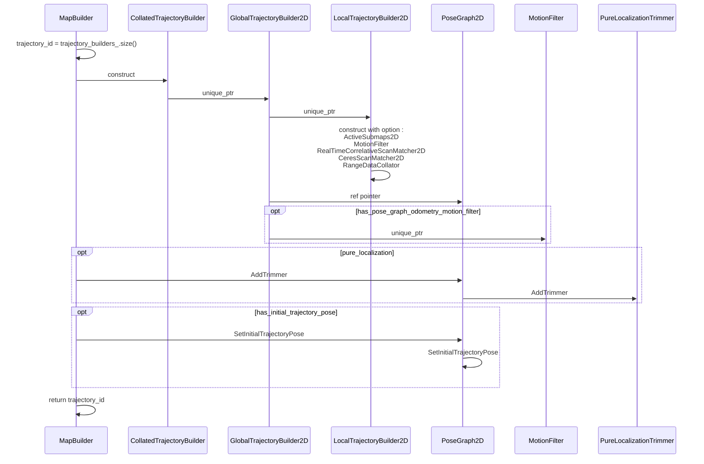

# mapping

* #TODO: (mid)...


## ValueConversionTables

```c++
// 0 is unknown, [1, 32767] maps to [lower_bound, upper_bound].
// vector[0] = unknown_result;
// vector[1, 32767] 存放的是 [lower_bound, upper_bound]，线性插值分布值；

// GetConversionTable(float unknown_result, float lower_bound, float upper_bound)
// 返回vector 大小 是 65536，相当于存放了两边，目前不清楚放两遍的作用

```

## probability_values.h

* 概率值相关定义
  * **Probability** ： 概率，定义范围为[0.1,0.9],即[kMinProbability,kMaxProbability] ，未知为 **kUnknownProbabilityValue = 0**；
  * **Odds**（优势） ：**probability / (1 - probability)** ，如果有一个事件发生的概率为probability，那么优势就是发生概率与不发生概率的比值。
  * **CorrespondenceCost**（匹配代价）：**（1 - probability）** , 高概率表示事件发生的可能性高，而代价则应该低。优化过程中，我们更倾向于使用代价（cost）的概念，因为优化通常是最小化代价。

> 通过查表法，用于将浮点数映射到紧凑的 uint16整数表示（范围 [1, 32767]），主要用于优化存储和处理效率；

##


## 序列图

以 2D建图分析，3D建图类似，只是不同的实例。

### MapBuilder 构造



### MapBuilder 添加 TrajectoryBuilder

```c++
/// return trajectory_id
  int AddTrajectoryBuilder(
      const std::set<SensorId> &expected_sensor_ids, // 期望传感器数据
      const proto::TrajectoryBuilderOptions &trajectory_options, // 轨迹构建器 参数
      LocalSlamResultCallback local_slam_result_callback // LocalSlam 结果回调
      ) override;

///
  struct SensorId {
    enum class SensorType {
      RANGE = 0,
      IMU,
      ODOMETRY,
      FIXED_FRAME_POSE,
      LANDMARK,
      LOCAL_SLAM_RESULT
    };

    SensorType type;
    std::string id;
  };
///
  // A callback which is called after local SLAM processes an accumulated
  // 'sensor::RangeData'. If the data was inserted into a submap, reports the
  // assigned 'NodeId', otherwise 'nullptr' if the data was filtered out.
  using LocalSlamResultCallback =
      std::function<void(int /* trajectory ID */, common::Time,
                         transform::Rigid3d /* local pose estimate */,
                         sensor::RangeData /* in local frame */,
                         std::unique_ptr<const InsertionResult>)>;

```


<!-- 
opt has_pose_graph_odometry_motion_filter
  MapBuilder ->> MotionFilter : construct
end -->

CollatedTrajectoryBuilder: 仅是使用 CollatorInterface 将数据分发给实际的 GlobalTrajectoryBuilder(2D/3D) , 统计不同id数据频率(RateTimer);

GlobalTrajectoryBuilder2D: 仅是将传感器数据转发给 LocalTrajectoryBuilder2D 和 PoseGraph2D
