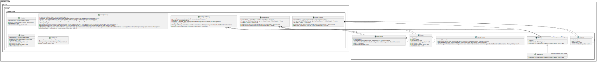

# metrics

[toc]

metrics: 指标,在通俗意义上是数值测量。
该模块提供空处理的实现类。

* 该测量功能通过 cartographer/cloud/BUILD.bazel 宏定义  **defines = ["USE_PROMETHEUS=1"]** 启用；
* 启用后，map_builder_server 运行前会实例化 prometheus::FamilyFactory，并注册相关函数RegisterAllMetrics，提供 0.0.0.0:9100 访问接口；

```c++
// cartographer/cloud/map_builder_server_main.cc

void Run(const std::string& configuration_directory,
         const std::string& configuration_basename) {
#if USE_PROMETHEUS
  metrics::prometheus::FamilyFactory registry;
  ::cartographer::metrics::RegisterAllMetrics(&registry);
  RegisterMapBuilderServerMetrics(&registry);
  ::prometheus::Exposer exposer("0.0.0.0:9100");
  exposer.RegisterCollectable(registry.GetCollectable());
  LOG(INFO) << "Exposing metrics at http://localhost:9100/metrics";
#endif

// cartographer/metrics/register.cc
void RegisterAllMetrics(FamilyFactory* registry) {
  mapping::constraints::ConstraintBuilder2D::RegisterMetrics(registry);
  mapping::constraints::ConstraintBuilder3D::RegisterMetrics(registry);
  mapping::GlobalTrajectoryBuilderRegisterMetrics(registry);
  mapping::LocalTrajectoryBuilder2D::RegisterMetrics(registry);
  mapping::LocalTrajectoryBuilder3D::RegisterMetrics(registry);
  mapping::PoseGraph2D::RegisterMetrics(registry);
  mapping::PoseGraph3D::RegisterMetrics(registry);
  sensor::TrajectoryCollator::RegisterMetrics(registry);
}
}
```

## 类图
@import "./assets/puml/metrics/metrics.svg"{width=100%}
<!-- {width=90%} -->
@import "./assets/puml/metrics/metrics_concise.puml"


## Prometheus
Prometheus 是一个开源的系统监控和告警工具包，
Prometheus : https://prometheus.ac.cn/docs/introduction/overview/

> 指标类型：
* Counter :  累积指标，表示一个单调递增计数器
* Gauge :  仪表盘 指标，表示一个可以任意增减的单一数值
* Histogram : 对观测值（通常是请求持续时间或响应大小等）进行采样，并将其计数到可配置的桶中


cloud/metrics/prometheus


RegisterAllMetrics