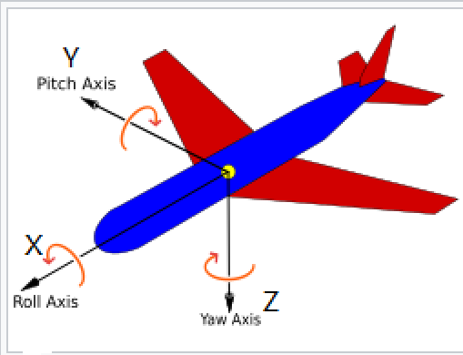

# transform

[toc]

二维/三维 刚体姿态定义，及相关转换函数；

# timestamped_transform.h

* proto消息转换 TimestampedTransform

# rigid_transform.h

### 1. Rigid2（二维刚体 姿态pos）

> 名词
translation:平移
rotation:旋转
scaling:缩放
Identity():单位矩阵


```cpp
template <typename FloatType>
class Rigid2 {
 public:
  using Vector = Eigen::Matrix<FloatType, 2, 1>;               // 二维向量 [x,y]
  using Rotation2D = Eigen::Rotation2D<FloatType>;             // 二维旋转 θ -> matrix [[cosθ, -sinθ], [sinθ, cosθ]]

  // 主要功能
  Rigid2 inverse() const;                                     // 计算逆变换
  operator*()                                                // 重载运算符：变换组合/点变换
};
```
- **表示方法**：平移向量 + 旋转角度
- **核心操作**：
  - 变换组合：`T1 * T2 = 组合变换`
  - 点变换：`T * point = 变换后的点`
  - 逆变换：`T.inverse()`
- **预定义类型**：
  ```cpp
  using Rigid2d = Rigid2<double>;
  using Rigid2f = Rigid2<float>;
  ```

### 2. Rigid3（三维刚体  姿态pos）
```cpp
template <typename FloatType>
class Rigid3 {
 public:
  using Vector = Eigen::Matrix<FloatType, 3, 1>;               // 三维向量 [x,y,z]
  using Quaternion = Eigen::Quaternion<FloatType>;            // 四元数 [w,x,y,z]

};
```
- **表示方法**：平移向量 + 四元数（旋转）
- **核心操作**：
  - 变换组合（支持四元数归一化）
  - 点变换
  - 逆变换（通过共轭四元数）
- **有效性检查**：确保非NaN值且四元数接近单位长度
- **预定义类型**：
  ```cpp
  using Rigid3d = Rigid3<double>;
  using Rigid3f = Rigid3<float>;
  ```

### 3. 辅助功能
```cpp
// 欧拉角 -> 四元数 (ROS URDF 规范)
Eigen::Quaterniond RollPitchYaw(double roll, double pitch, double yaw);

// 从Lua配置解析变换参数
Rigid3d FromDictionary(common::LuaParameterDictionary* dictionary);
```

```cpp
// 典型使用示例
Rigid3d world_to_camera = ...;
Rigid3d camera_to_object = ...;
Rigid3d world_to_object = world_to_camera * camera_to_object;

Eigen::Vector3d point_in_camera = ...;
Eigen::Vector3d point_in_world = world_to_camera * point_in_camera;
```

---

# transform.h

### 1. 核心功能函数
- **旋转角度提取**
  ```cpp
  GetAngle(Rigid3<T>) // 提取旋转变换的总弧度（非负值）
  // 旋转的幅度（大小），而不考虑旋转方向
  // 可以用来评估相邻位姿间的旋转程度 （判断机器人是否急转弯）

  GetYaw(Eigen::Quaternion<T>) // 提取偏航角(yaw)
  GetYaw(Rigid3<T>) // 换提取偏航角
  ```

- **AngleAxis表示转换**
  - `RotationQuaternionToAngleAxisVector()`：四元数 → 角轴向量 
  - `AngleAxisVectorToRotationQuaternion()`：角轴向量 → 四元数（反向转换）

- **维度投影**
  - `Project2D()`：3D姿态 → 2D姿态（丢弃Z轴，保留XY平移+Yaw旋转）
  - `Embed3D()`：2D姿态 → 3D姿态（Z=0）

### 2. Proto转换接口
实现Eigen数据结构与Protocol Buffers的互转：
```cpp
ToEigen(proto::T)      // proto::T → Eigen::T
ToProto(Eigen::T)              // Eigen::T → proto::T
```

# transform_interpolation_buffer.h

# euler angles

* https://en.wikipedia.org/wiki/Euler_angles

> 在航空航天和机器人学中，物体的3D方向通常用三个角度来描述：roll（滚转角）、pitch（俯仰角）和yaw（偏航角）。这三个角度统称为欧拉角，它们描述了物体绕固定坐标系的三个轴的旋转。

1. ​​基本定义​​
​​Roll (滚转角)​​: 绕​​X轴​​旋转的角度。它表示物体绕前后轴的旋转（比如飞机的侧滚）。正角度表示逆时针旋转（从轴的负方向观察）。
​​Pitch (俯仰角)​​: 绕​​Y轴​​旋转的角度。它表示物体绕左右轴的旋转（比如飞机的俯仰）。正角度表示抬头（机头向上）。
​​Yaw (偏航角)​​: 绕​​Z轴​​旋转的角度。它表示物体绕垂直轴的旋转（比如飞机的偏航）。正角度表示逆时针旋转（从上往下看，飞机向左转）。

<figure style="text-align: center;">
  
  <figcaption style="text-align: center; font-style: italic;">图: roll-pitch-yaw </figcaption>
</figure>


2. ​​坐标系约定​​
通常使用​​右手坐标系​​：
​​X轴​​：指向物体的前方（或参考方向）
​​Y轴​​：指向物体的右侧
​​Z轴​​：指向物体的下方（航空航天中通常向上为正，但这里按照右手坐标系，Z轴向下是常见的）


<figure style="text-align: center;">
  
  <figcaption style="text-align: center; font-style: italic;">图: example z-x′-z″ </figcaption>
</figure>

3. 在右手坐标系中：
大拇指指向 +X 轴方向。
食指指向 +Y 轴方向。
中指指向 +Z 轴方向。
绕一个坐标轴的正旋转方向由右手定则确定：弯曲右手四指指向旋转方向，则大拇指指向该轴的正方向。

---

# Quaternion （四元数）

表示形式​​:
​​代数形式​​：q=w+xi+yj+zk
​​标量-向量形式​​：q=(w,v)，其中 v=(x,y,z)是三维向量。
​​分量形式​​：q=[w,x,y,z]

---

# Axis–angle 
* 按指定轴向量进行角度旋转；

- example:
- **旋转描述**：当观察者站在地面（重力方向为负z轴），左转90度等同于绕z轴旋转 π/2 弧度（即90度）。
- **轴角表示法（Axis-Angle Representation）**：
  - 单位旋转轴向量：\(\begin{bmatrix} a_x \\ a_y \\ a_z \end{bmatrix} = \begin{bmatrix} 0 \\ 0 \\ 1 \end{bmatrix}\)（指向z轴正方向）。
  - 旋转角度：\(\theta = \frac{\pi}{2}\)。
  - 完整表示：\(\left\langle \begin{bmatrix} 0 \\ 0 \\ 1 \end{bmatrix}, \frac{\pi}{2} \right\rangle\)。
- **等价旋转向量表示（Rotation Vector）**：
  - 该向量定义为：\(\begin{bmatrix} 0 \\ 0 \\ \frac{\pi}{2} \end{bmatrix}\)，其中向量的模（大小）等于旋转角度 \(\frac{\pi}{2}\)，方向对应旋转轴 \([0, 0, 1]\)。
  


###  **轴角表示法 (Axis-Angle Representation)**  
   - **定义**：旋转 = **单位旋转轴向量** + **旋转角度**  
     - 轴向量：\(\mathbf{a} = \begin{bmatrix} a_x \\ a_y \\ a_z \end{bmatrix}\)（需满足 \(\|\mathbf{a}\| = 1\))  
     - 角度：\(\theta\)（弧度制）  
   - **示例**（图片中的左转90°）：  
     \[
     \mathbf{a} = \begin{bmatrix} 0 \\ 0 \\ 1 \end{bmatrix}, \quad \theta = \frac{\pi}{2}
     \]

---

###  **旋转向量表示法 (Rotation Vector)**  
   - **定义**：将轴角压缩为一个向量：\(\mathbf{v} = \theta \cdot \mathbf{a}\)  
     - 方向 = 旋转轴方向  
     - 模长 \(\|\mathbf{v}\| = \theta\) = 旋转角度  
   - **示例**：  
     \[
     \mathbf{v} = \theta \cdot \mathbf{a} = \frac{\pi}{2} \begin{bmatrix} 0 \\ 0 \\ 1 \end{bmatrix} = \begin{bmatrix} 0 \\ 0 \\ \frac{\pi}{2} \end{bmatrix}
     \]

---

### 表示法的对比
| **表示法**          | **形式**                                              | **特点**                 |
| ------------------- | ----------------------------------------------------- | ------------------------ |
| 轴角表示法          | \(\langle \mathbf{a}, \theta \rangle\)                | 直观，但需单位向量约束   |
| 旋转向量            | \(\mathbf{v} = \theta \mathbf{a}\)                    | 紧凑，适合数值计算       |
| 旋转矩阵            | \(3 \times 3\) 正交矩阵                               | 无奇异性，可复合旋转     |
| 四元数 (Quaternion) | \(q = [\cos(\theta/2), \, \mathbf{a}\sin(\theta/2)]\) | 计算高效，避免万向节死锁 |

> **关键公式**：旋转向量 → 旋转矩阵的转换（罗德里格斯公式）:  
> \[
> R = \mathbf{I} + \sin\theta \cdot [\mathbf{a}]_\times + (1-\cos\theta) \cdot [\mathbf{a}]_\times^2
> \]  
> 其中 \([\mathbf{a}]_\times\) 是轴向量的叉积矩阵。

如有具体场景需求（如代码实现或不同表示转换），请进一步说明！ 🙂