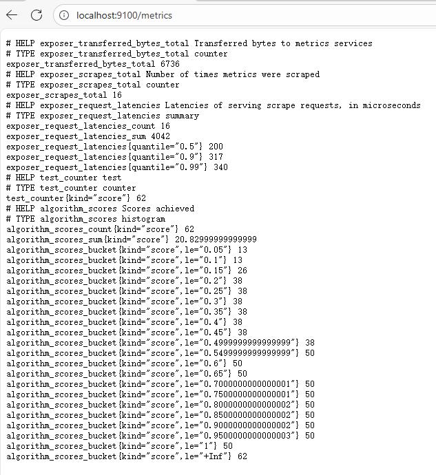
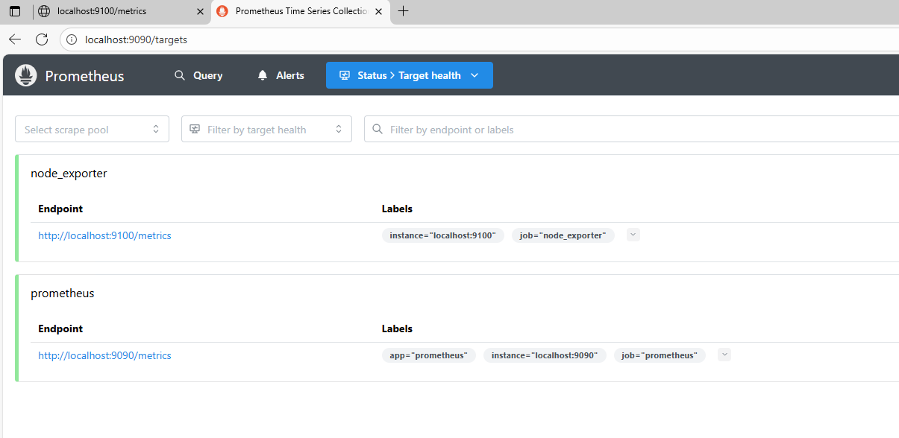
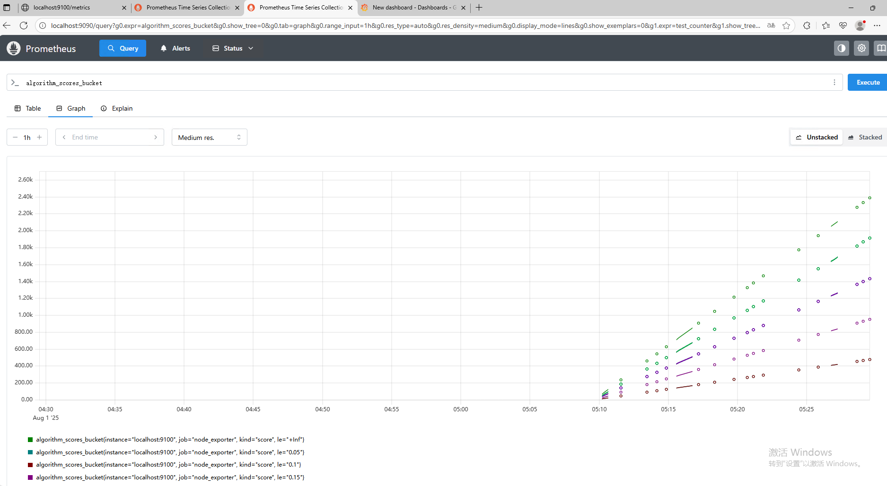
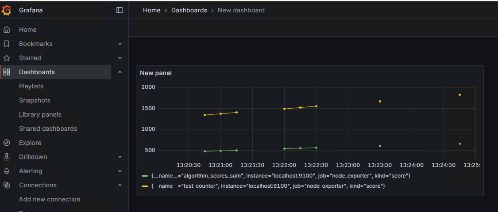

# plugin_metrics_prometheus

将 cartographer 中 cloud/metrics/prometheus 功能以插件形式实现；

## 使用

* 编译后动态库： libplugin_metrics_prometheus.so

* 动态库加载：

```c++
///   cartographer/plugin/metrics/prometheus/metrics_test.cc

class DllFamilyFactory {
 public:
  using GetFamilyFactoryFunc = void*();
  using StartExposerFunc = bool(const char* addr);

 public:
  bool Load(const std::string& library_path) {
    try {
      library_ = boost::dll::shared_library(
          library_path, boost::dll::load_mode::append_decorations);

      auto func = library_.get<GetFamilyFactoryFunc>("GetFamilyFactory");
      family_factory_ = static_cast<FamilyFactory*>(func());

      start_exposer_func_ = library_.get<StartExposerFunc>("StartExposer");
      return true;
    } catch (const std::exception& e) {
      LOG(ERROR) << "Failed to load library: " << e.what();
      return false;
    }
  }

  FamilyFactory* GetFamilyFactory() { return family_factory_; }
  bool StartExposer(const char* addr) { return start_exposer_func_(addr); }

 private:
  boost::dll::shared_library library_;
  FamilyFactory* family_factory_ = nullptr;
  StartExposerFunc* start_exposer_func_ = nullptr;

 private:
};
```

---

* 调用：

```c++
///   cartographer/plugin/metrics/prometheus/metrics_test.cc

TEST(MetricsTest, RunExposerServer) {
  DllFamilyFactory dll_factory;
  dll_factory.Load(
      "/root/ws/cartographer/build/cartographer/plugin/metrics/prometheus/"
      "libplugin_metrics_prometheus.so");
  auto registry = dll_factory.GetFamilyFactory();
  Algorithm::RegisterMetrics(registry);
  // ::cartographer::metrics::RegisterAllMetrics(registry);
  dll_factory.StartExposer("0.0.0.0:9100");

  Algorithm algorithm;
  algorithm.Run();
}

```

## 数据监控

### 本地访问

* 使用docker运行test时，可将端口 port 9100 映射到 localhost:9100,便于进行访问



---

### prometheus server

* download link : <https://prometheus.io/download/>

* doc : <https://prometheus.io/docs/introduction/overview/>

* 配置 prometheus.yml,添加以下字段：

```yaml
  - job_name: "node_exporter"       # 节点监控
    static_configs:
      - targets: ["localhost:9100"]  # 添加目标地址

```

* 完整配置文件如下：

```yaml
# my global config
global:
  scrape_interval: 2s # Set the scrape interval to every 15 seconds. Default is every 1 minute.
  evaluation_interval: 2s # Evaluate rules every 15 seconds. The default is every 1 minute.
  # scrape_timeout is set to the global default (10s).

# Alertmanager configuration
alerting:
  alertmanagers:
    - static_configs:
        - targets:
          # - alertmanager:9093

# Load rules once and periodically evaluate them according to the global 'evaluation_interval'.
rule_files:
  # - "first_rules.yml"
  # - "second_rules.yml"

# A scrape configuration containing exactly one endpoint to scrape:
# Here it's Prometheus itself.
scrape_configs:
  # The job name is added as a label `job=<job_name>` to any timeseries scraped from this config.
  - job_name: "prometheus"

    # metrics_path defaults to '/metrics'
    # scheme defaults to 'http'.

    static_configs:
      - targets: ["localhost:9090"]
       # The label name is added as a label `label_name=<label_value>` to any timeseries scraped from this config.
        labels:
          app: "prometheus"
          
  - job_name: "node_exporter"       # 节点监控
    static_configs:
      - targets: ["localhost:9100"]  # 添加目标地址


```

* 访问prometheus server  ( localhost:9090) , 可看到 localhost:9100 已被加入到监听：



* 选择数据进行监控：



---

### Grafana 监控

* doc : <https://prometheus.io/docs/tutorials/visualizing_metrics_using_grafana/>


