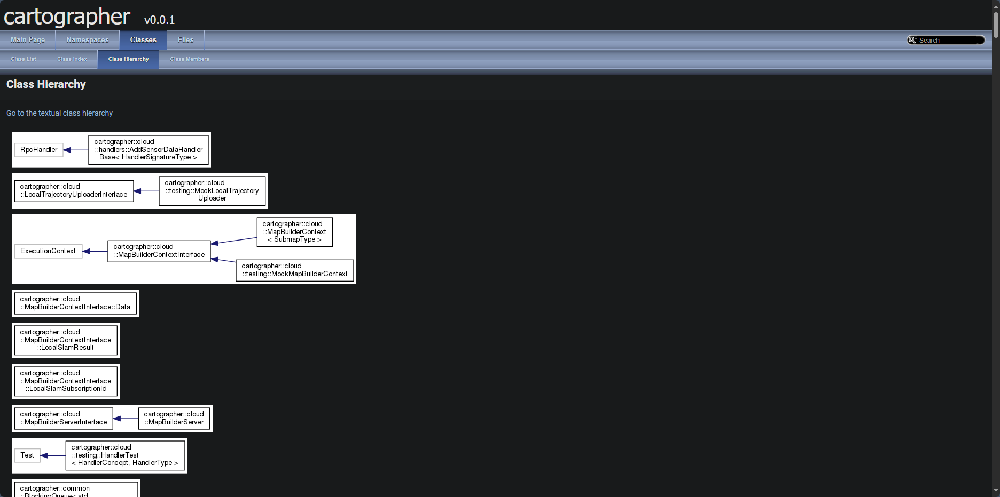

# doxygen 

* doxygen介绍： Doxygen​​ 是一个开源的​​代码文档生成工具​​，主要用于从代码中的特殊注释自动生成技术文档。支持 ​​C++​​、​​C​​、​​Java​​、​​Python​​、​​PHP​​、​​C#​​ 等主流编程语言；
* doxygen文档： https://www.doxygen.nl/manual/index.html
* 使用 doxygen 生成相关文档辅助阅读代码；

* 安装生成脚本：
```bash
# install 
apt install doxygen

# generate doc to build/doc
mkdir -p  build && doxygen ./doc_gen.doxy

```

* 浏览器打开 build/doc/html/index.html 



---

# cartographer

* 文档阅读（渲染.puml文件）：vscode , extension: shd101wyy.markdown-preview-enhanced
* 或使用其他类似软件

## cloud

## common
* breif
<!--  -->


## ground_truth

## io

## mapping

## metrics

## sensor

## transform
